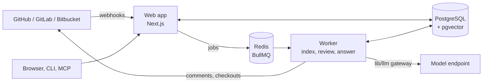

# OpenReview

OpenReview is an open-source, self-hostable AI reviewer for pull requests. It indexes your whole repository (symbols,
call graph, imports, tests, routes, schemas, docs) into PostgreSQL with pgvector, and when a pull request opens it
reviews the change with that context: specialized agents look for correctness, security, data, API compatibility,
testing, and performance problems, every candidate finding is verified against the actual code before it is posted,
and the results appear as inline comments plus one summary comment. It runs on a single server with Docker Compose;
besides your git host and the model endpoint you configure (Anthropic by default, or OpenAI, OpenRouter, or a
self-hosted OpenAI-compatible model), it needs no hosted service. License: AGPL-3.0-only.

## Features

- **Codebase-aware reviews.** An incremental index with a code graph and hybrid retrieval (graph walks, full-text,
  embeddings) gives each review the callers, dependents, tests, and conventions a change touches.
  [Architecture](docs/ARCHITECTURE.md#retrieval)
- **Verified findings.** Findings must be anchored in the diff and grounded in real code, pass a judge, and are ranked
  and capped; rejected candidates stay visible in the dashboard with the reason.
  [Review engine](docs/ARCHITECTURE.md#review-engine)
- **Pull request workflow.** Inline comments and one summary comment that is updated in place; incremental
  re-reviews on new commits that mark fixed findings resolved; fast, standard, and deep modes; a security-focused
  review on request.
- **Conversations.** Mention `@openreview` (configurable) in a pull request to ask about a finding or the code, or to
  re-review, ignore a pattern, or record feedback.
- **Team rules and learning.** Plain-English rules in the dashboard or `openreview.json`; feedback (reactions,
  replies, dashboard votes) becomes learned preferences; teammates' review comments are mined into candidate rules.
- **Knowledge base.** Subsystem notes generated from the index, kept fresh as code changes, editable, and used as
  review context.
- **Dashboard.** Overview, repositories and index status, reviews with stage timings and costs, findings, rules,
  team, usage, activity (webhook deliveries with replay), and settings.
- **For coding agents.** A REST API with OpenAPI ([`/api/v1/openapi.json`](lib/api/openapi.ts)), an MCP server
  ([docs/mcp.md](docs/mcp.md)), a CLI that reviews local changes ([docs/cli.md](docs/cli.md)), fix prompts, and a
  Claude Code plugin ([integrations/claude-code](integrations/claude-code/README.md)).
- **Git hosts.** GitHub (App), GitHub Enterprise Server, GitLab (cloud and self-managed), and Bitbucket Cloud.
- **For organizations.** Roles and invitations, OIDC and SAML single sign-on, an audit log, a model provider per
  organization, usage caps and alerts, optional Stripe billing, an offline mode that refuses outbound traffic to
  anything but the configured model endpoint, git host, and identity providers, and runtime validation of tests in a
  sandbox (beta). [Self-hosting](docs/self-hosting.md)

## Architecture



The web app receives webhooks and serves the dashboard and APIs; the worker indexes repositories, runs reviews,
answers mentions, and refreshes the knowledge base. See [docs/ARCHITECTURE.md](docs/ARCHITECTURE.md) and
[docs/DATABASE.md](docs/DATABASE.md).

## Quick start (Docker Compose)

On a server with Docker and the Compose plugin, a domain pointing at it, an Anthropic API key (or another
[model provider](docs/models.md)), and an OpenAI API key for embeddings (or another
[embedding endpoint](docs/models.md#embeddings)):

```sh
git clone https://github.com/openreview/openreview.git && cd openreview
cp .env.example .env   # set APP_URL=https://<domain>, OPENREVIEW_DOMAIN=<domain>, APP_SECRET, ANTHROPIC_API_KEY, EMBEDDING_API_KEY
export COMPOSE_FILE=docker-compose.yml:deploy/docker-compose.prod.yml   # adds Caddy with automatic HTTPS
docker compose up -d --build
# open https://<domain>/setup/github-app, create the GitHub App, paste the lines it shows into .env, then:
docker compose up -d
```

Sign in at `https://<domain>` and install the App on your repositories; indexing starts right away and the next pull
request gets a review. `docker compose ps` should show every service healthy (the worker restarts until the GitHub App
variables are set); migrations run automatically when the app starts. The
[self-hosting guide](docs/self-hosting.md) covers server sizing, DNS and TLS, backups (`deploy/backup.sh`), upgrades,
scaling, and offline operation.

Without the production override, `docker compose up -d --build` serves the app on `http://localhost:3000`, which is
enough to look around; GitHub can only deliver webhooks to a public address.

## Local development

```sh
pnpm install
cp .env.example .env          # APP_SECRET, AUTH_DEV_LOGIN=true for local sign-in
# PostgreSQL 16 with pgvector and Redis on localhost (see CONTRIBUTING.md for docker run commands)
pnpm dev                      # http://localhost:3000 (applies migrations on start)
pnpm worker                   # background jobs, in a second terminal
pnpm typecheck && pnpm lint && pnpm test
```

Useful scripts: `pnpm db:migrate` (apply migrations), `pnpm db:generate` (migration from the schema),
`pnpm verify:parity --phase 1` (typecheck, lint, tests, build, and a pass/fail line per spec feature), `pnpm cli:build`,
`pnpm mcp:build`, `pnpm deps:audit`. See [CONTRIBUTING.md](CONTRIBUTING.md).

### Try a review without a GitHub App

Demo mode adds a development-only local git host. With `DEMO_MODE=true` and `AUTH_DEV_LOGIN=true` in `.env`:

```sh
pnpm db:migrate
LLM_PROVIDER=fake pnpm demo   # offline: replays recorded model answers (labelled as a recording)
pnpm demo                     # or with your configured model (LLM_PROVIDER / LLM_API_KEY)
pnpm dev                      # sign in as the local developer and open the printed review URL
```

`pnpm demo` indexes [`fixtures/demo-repo`](fixtures/demo-repo), opens a pull request with a deliberate cross-file bug,
and runs the real review pipeline. The evaluation harness (`pnpm eval`) measures precision and recall on the labelled
cases in [`eval/`](eval/README.md); `pnpm eval --provider fake --recorded` replays committed recordings and only checks
that the harness works, it says nothing about model quality.

## GitHub App

Each server uses its own GitHub App. The easiest way to create it is `/setup/github-app`, which posts
[`github-app-manifest.json`](github-app-manifest.json) to GitHub's app-manifest flow with the right permissions
(metadata read, contents read, pull requests write, issues write, checks read), events, webhook URL, and sign-in
callback, then shows the new App's credentials once for `.env`. It is open on a fresh install and afterwards only to
instance administrators (`INSTANCE_ADMIN_EMAILS`, or the first user). Manual setup, permissions, and events are
explained in [docs/github-app.md](docs/github-app.md).

## Configuration

Every environment variable is listed in [`.env.example`](.env.example) and documented, with defaults and effects, in
[docs/configuration.md](docs/configuration.md). The minimum is `APP_SECRET`, the four GitHub App variables, a model key,
and an embedding key; Compose provides the database and Redis.

## Models

Anthropic is the default (`ANTHROPIC_API_KEY` is enough; tasks route to suitable Claude models). Set `LLM_PROVIDER` to
`openai`, `openrouter`, or `openai-compatible` (vLLM, Ollama, LM Studio, TGI, ...) with `LLM_MODEL`, `LLM_BASE_URL`, and
`LLM_API_KEY`. Each task (review, verify, summary, classify, chat, knowledge, rules) and the fast and deep modes can use
their own model, and each organization can bring its own provider in **Settings → Model provider**. Details:
[docs/models.md](docs/models.md).

## CLI

```sh
npm i -g openreview
openreview login --server https://review.example.com
openreview review               # review this branch against its base, before opening a pull request
openreview review --local       # or entirely on your machine with your own model key
```

See [docs/cli.md](docs/cli.md) and the full reference in [packages/cli/README.md](packages/cli/README.md).

## MCP and coding agents

Coding agents can list a pull request's unresolved findings, get fix prompts, mark findings resolved, request
re-reviews, and search the indexed codebase through MCP: remotely at `https://<server>/api/mcp`, or locally with
`npx -y openreview-mcp`. Setup for Claude Code, Cursor, Codex, and Claude Desktop is in [docs/mcp.md](docs/mcp.md); the
Claude Code plugin and the review-fix loop are in [integrations/claude-code](integrations/claude-code/README.md).

## GitLab and Bitbucket

Admins connect GitLab (gitlab.com or self-managed) or Bitbucket Cloud with an access token in **Settings → Git
providers**; OpenReview creates the webhooks itself. See [docs/gitlab.md](docs/gitlab.md) and
[docs/bitbucket.md](docs/bitbucket.md).

## Troubleshooting

`/api/health`, `docker compose ps`, and `docker compose logs app worker` (structured JSON with correlation ids) are
the first stops; **Activity** in the dashboard shows every webhook delivery and lets you replay failed ones. Common
problems (webhook `401`, missing permissions, indexing that does not finish, model errors, rate limits, SSO) are in
[docs/troubleshooting.md](docs/troubleshooting.md).

## Contributing

Contributions are welcome. [CONTRIBUTING.md](CONTRIBUTING.md) covers the development setup, tests (every feature ID
in [the spec](docs/OPENREVIEW_SPEC.md) has tests named after it), migrations, and commit style. Please follow the
[code of conduct](CODE_OF_CONDUCT.md).

## Security

Report vulnerabilities privately as described in [SECURITY.md](SECURITY.md), which also documents the threat model:
trust boundaries, tenant isolation, secrets at rest, the outbound allowlist, and how repository content is kept from
overriding instructions (prompt-injection handling).

## License

OpenReview is licensed under the [GNU Affero General Public License v3.0 only](LICENSE) (AGPL-3.0-only); the CLI and
MCP packages are too. If you run a modified version for users over a network, section 13 requires offering them its
source: set `SOURCE_CODE_URL` to where your modified source is published, and the dashboard footer links to it.
