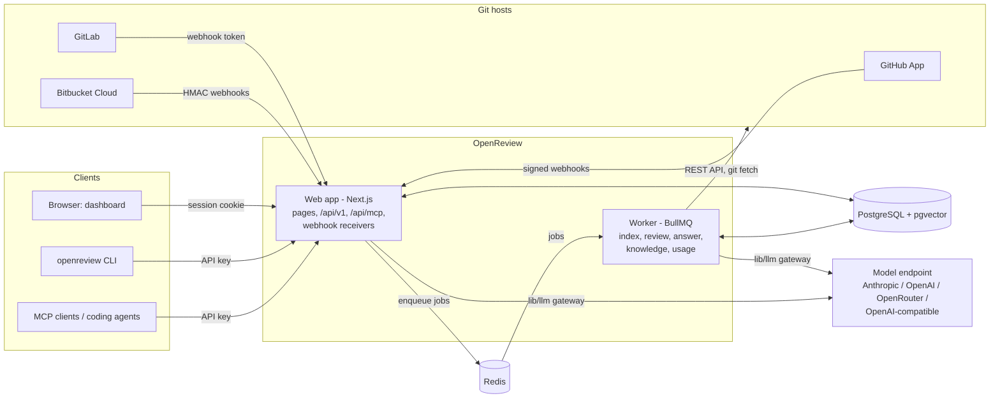
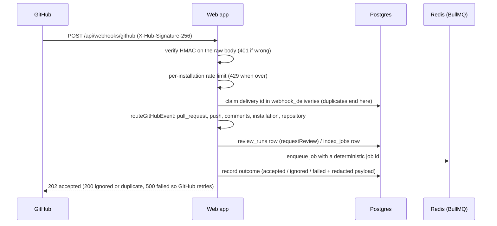
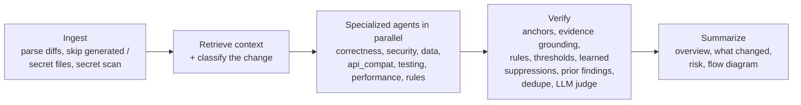
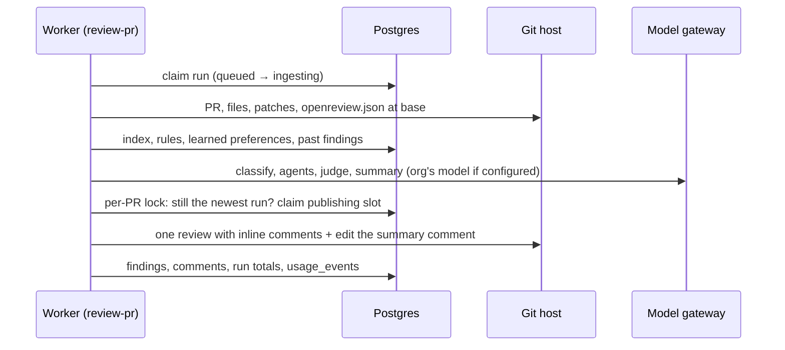

# Architecture

OpenReview is one TypeScript codebase that runs as two processes, a **web app** and a **worker**, on top of
**PostgreSQL with pgvector** and **Redis**. Everything a review needs (the code index, the knowledge base, findings,
feedback, settings) lives in Postgres; Redis holds the job queue, rate-limit counters, and worker heartbeats. No hosted
service is required besides the configured model endpoint and the git host.

## Components

| Component | Code | Role |
| --- | --- | --- |
| Web app | `app/`, `components/`, `lib/**` | Next.js App Router. Dashboard pages, sign-in (GitHub OAuth, OIDC, SAML), REST API v1 (`app/api/v1`, route table `lib/api/v1.ts`), MCP endpoint (`app/api/mcp`), webhook receivers (`app/api/webhooks/{github,gitlab,bitbucket}`), Stripe webhook, health check (`app/api/health`). Applies migrations on start (`instrumentation.ts`). |
| Worker | `worker/index.ts`, `lib/jobs/handlers.ts` | Consumes the `openreview` BullMQ queue (jobs: `index-repo`, `review-pr`, `answer-mention`, `sync-feedback`, `mine-rules`, `refresh-knowledge`, `report-usage`, `demo-review`), prunes retention-limited tables hourly, recovers abandoned review runs every five minutes, and writes a heartbeat to Redis for its health check. |
| PostgreSQL + pgvector | `lib/db/schema.ts`, `drizzle/` | All durable state; embeddings in `vector(1536)` columns with HNSW indexes. See [DATABASE.md](DATABASE.md). |
| Redis | `lib/redis.ts`, `lib/jobs/queue.ts` | BullMQ queue (priorities: mentions, then reviews, feedback, indexing, rule mining, knowledge, usage, demo), Redis-backed rate limits, worker heartbeats. |
| Model gateway | `lib/llm` | The only way to call a model (hard rule H4): provider selection and per-task routing, per-org overrides, timeouts, retries, cost recording, response and embedding caches. See [models](models.md). |
| CLI | `packages/cli` | `openreview` command: reviews local changes against the server (`POST /api/v1/reviews/local`) or fully locally with an embedded PGlite index. |
| MCP | `lib/mcp/server.ts`, `packages/mcp` | The same tools over Streamable HTTP (`/api/mcp`) and stdio (`openreview-mcp`), backed by the REST API. |

Jobs are retried by BullMQ (three attempts, exponential backoff from five seconds). Contention (a repository's index
lock, a busy publishing slot) and git host rate limits delay a job instead of spending an attempt.

## From webhook to job

`lib/webhooks/github.ts` handles `pull_request` (opened, synchronize, reopened, ready for review, closed),
`pull_request_review`, `pull_request_review_comment`, `issue_comment` (mentions and commands), `push` (incremental
indexing of the default branch), `installation` / `installation_repositories` (linking, permissions, repository sync),
and `repository` (renames, transfers, archiving, default branch). GitLab and Bitbucket deliveries go through
`lib/webhooks/scm.ts` with per-repository secrets and are recorded the same way. A failed delivery keeps its redacted
payload and can be replayed from **Activity**.

## Indexing

`index-repo` (`lib/indexer`) fetches the repository into `REPO_CACHE_DIR`, then for each file whose content changed
(every file on a full run): skips generated, vendored, binary, secret, and oversized files; redacts secret-looking
lines; parses with tree-sitter (TypeScript/TSX, JavaScript, Python, Go, Java, Rust, C#) into symbols, imports, calls,
routes, tables, and tests; writes chunks (code by symbol windows, docs by heading, config by top-level keys) with a
full-text `tsvector`; records manifests' dependencies and recent commits; embeds new symbols and doc chunks; and
resolves the graph (`call`, `import`, `export`, `reference`, `extends`, `implements`, `depends_on`, `tested_by`,
`route_handler`, `schema_consumer`). Each file is written in its own transaction, so a review running during
re-indexing sees each file entirely before or after. A Postgres advisory lock keeps two index runs of one repository
from interleaving, across workers. Progress is tracked in `index_jobs`. A completed run with changes queues a
knowledge refresh.

## Retrieval

`retrieveContext` (`lib/retrieval`) builds a ranked, deduplicated, token-budgeted bundle for a change: definitions of
changed symbols, callers, callees, importers, transitive dependents (depth by mode), related tests, routes and schema
consumers, nearby manifests and config, exact symbol and path matches for identifiers in the diff, full-text matches,
embedding neighbors (code and docs), repository instruction files, knowledge base notes for the touched subsystems,
recently co-changed files, past findings, and team rules. Every item records why it was retrieved, and the output is
deterministic for the same inputs.

## Review engine

`runReview` (`lib/engine`) is the single review implementation used by pull request reviews, the CLI, the API, MCP,
and the demo. It works from a list of changed files with patches, a `readFile(path, base|head)` function, and the
index, so it is independent of the git host.

- **Modes** (`lib/engine/modes.ts`): fast runs at most 2 agents with a 12k-token context budget and no model
  classification; standard runs up to 5 with 40k; deep runs all with 100k and deeper dependent traversal. Each mode
  costs `CREDITS_FAST|STANDARD|DEEP` credits and may use its own models.
- **Agents** (`lib/engine/agents.ts`) are chosen from the change classification and settings; each returns candidate
  findings with evidence as schema-validated JSON.
- **Verification** (`lib/engine/verify.ts`) drops any candidate that is not anchored in the diff, cites evidence that
  does not exist in the code, falls under a threshold or a learned suppression, or duplicates an existing comment; a
  judge call checks the rest. Survivors are ranked and capped at the repository's comment limit. Rejected candidates
  are kept with the stage and reason, visible in the dashboard.
- **Identity** (`lib/engine/identity.ts`): findings carry a fingerprint, so a re-review recognizes findings it already
  reported (even after lines move) and marks ones the new commits fixed as resolved.

## Review pipeline and publishing

Every way a review starts (webhook, dashboard, `@openreview` command, REST API, CLI against a pull request) calls
`requestReview` (`lib/pipeline/request.ts`), which records a `review_runs` row and enqueues `review-pr`. Pushes are
debounced by `REVIEW_DEBOUNCE_MS`. The job (`lib/review/run.ts`) moves the run through
`queued → ingesting → retrieving_context → reviewing → verifying → summarizing → publishing → completed` (or
`failed`, `cancelled`, `superseded`, `skipped`), recording stage timings. Before reviewing it checks the gates
(repository enabled and not archived, installation not suspended, pull request open, settings such as drafts and
branch filters from the dashboard and `openreview.json` on the base branch, usage limits). A run whose head moved or
that a newer run replaced ends `superseded`; publishing re-checks that under a per-PR advisory lock, so an obsolete run
never posts. A worker that crashes mid-run leaves a stale heartbeat; recovery re-queues the run (at most three times).

`lib/review/publish.ts` posts new findings as one review with inline comments (never more than the comment cap per
run), edits the single summary comment in place, edits resolved findings' comments to say they were resolved, and
never re-posts a finding already on the pull request.

## Learning

Reactions and replies on OpenReview's comments (`sync-feedback`), dashboard, API, MCP, and CLI feedback, and
`/openreview` feedback commands become `finding_feedback` rows. `lib/learning` folds them into learned preferences
(`learned_patterns`): suppressions for findings a team keeps rejecting, boosts for ones it values, and per-category
confidence adjustments, all editable on **Rules → Learned**. Teammates' own review comments are mined (`mine-rules`)
into candidate rules that take effect only after someone approves them.

## Knowledge base

After indexing, `refresh-knowledge` (`lib/knowledge`) discovers subsystems from the code graph, marks entries whose
files changed as stale, and regenerates at most `KNOWLEDGE_MAX_ENTRIES_PER_RUN` of them per run with the `knowledge`
model task (key files, dependencies, risks, conventions, past findings). People can edit entries; a later regeneration
of an edited entry is stored as a proposal. Retrieval includes the notes for subsystems a change touches.

## Conversations

A comment that mentions `@openreview` (or starts with `/openreview`) in a pull request, a review body, or an inline
thread is answered by `answer-mention` (`lib/conversations`): the intent is detected (rules first, a cheap model call
only for ambiguous comments); commands (re-review, security review, ignore this pattern, resolved / won't fix / false
positive / useful / not useful) need the commenter to be an owner, member, or collaborator; questions are answered from
the finding, its evidence, the current code, and retrieval. Threads and messages are stored in `conversations` and
`conversation_messages`.

## API, MCP, and CLI

- **REST API v1** (`lib/api`): API keys (`or_live_…`, stored as SHA-256, scoped, expiring, revocable) or the session
  cookie with a same-origin check; per-key rate limit; zod-validated input; every write audited. The OpenAPI document
  is served at `/api/v1/openapi.json`.
- **MCP** (`/api/mcp`, `openreview-mcp`): tools to list and read findings with fix prompts, record feedback, request
  re-reviews, and search the codebase, all through the REST API's scopes and limits. See [mcp.md](mcp.md).
- **CLI** (`packages/cli`): server mode sends the diff and changed files to `POST /api/v1/reviews/local`, which runs
  `runReview` against the server's index with the organization's settings, rules, learned preferences, and model
  provider, and posts nothing to the git host. Local mode builds a PGlite index in `.openreview/`. See [cli.md](cli.md).

## Multi-tenancy

Every tenant-owned table carries `org_id`, and every query filters by it through `scoped(table, orgId, …)`
(`lib/data/tenant.ts`). The org comes from the session (`requireOrg`) or the API key, never from the request.
Webhooks resolve the org from the installation (GitHub) or the per-repository hook (GitLab, Bitbucket). Roles
(`owner`, `admin`, `member`) are checked server-side on every action (`lib/auth/permissions.ts`). Deleting an
organization cascades through every tenant table. Two tables are deliberately shared: `embedding_cache` (vectors keyed
by model and content hash, no text) and `pending_installations` (installations no org has claimed yet).

The public demo (`/try`, off by default) runs as the system organization `org_demo`, which has no members and a
placeholder installation with no git host; billing and usage-alert sweeps skip it.

## Security boundaries

[SECURITY.md](../SECURITY.md) has the full threat model. In short: signed webhooks verified before parsing; database
sessions (only token hashes stored) with `HttpOnly`, `SameSite=Lax`, `Secure` cookies; same-origin checks on
cookie-authenticated mutations; CSP and framing headers on every response; secrets at rest encrypted with AES-256-GCM
(`lib/crypto.ts`); one allowlisted outbound `fetch` (`lib/net/fetch.ts`) with an SSRF guard for user-supplied URLs;
log redaction of tokens and secret-named fields; runtime validation in a container with no network, no capabilities,
and resource limits.

## Prompt injection (H7)

Repository content, pull request text, and comments are untrusted. `lib/engine/prompt.ts` keeps instructions in the
system prompt only and puts every piece of content in a tagged data block that carries a per-review nonce
(`<repo_code nonce="…">…</repo_code nonce="…">`); content cannot open or close a block because engine tags inside it
are neutralized and it cannot contain the nonce. Prompts state that data blocks are data. Model output is validated
against schemas, findings must be grounded in real code, settings and rules come only from the dashboard and
`openreview.json` on the base branch, and comments can change state only through explicit commands from
collaborators.

## Cost controls

- Review modes bound how many agents run and how much context they see; per-repository comment caps bound output.
- Token budgets (`lib/llm/budget.ts`) keep prompts inside each mode's context budget.
- Response cache for deterministic calls and a shared, content-addressed embedding cache.
- Incremental indexing and incremental re-reviews (only commits since the last reviewed head).
- Push debouncing, superseding of obsolete runs, cancellation from the dashboard and API.
- Every call recorded in `model_calls` with estimated cost; per-org monthly credit and cost caps with alerts
  (`usage_settings`, `usage_alerts`); optional Stripe billing.
